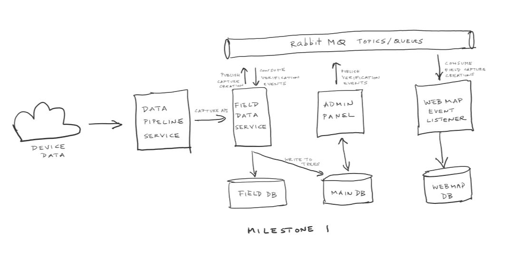
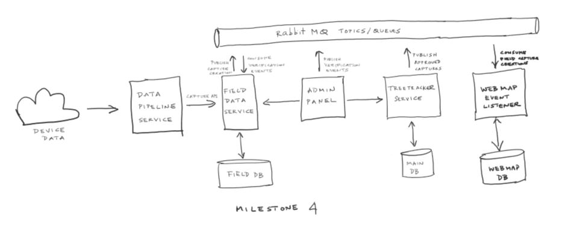

# Domain Migration 

## Services based on domain Model 

The **larger goal** of the domain migration project is to create service oriented architecture with each service powered by domain models that are closely related and models/reflects the activity/language of Greenstand and one that is set for continued evolution of the platform as Greenstand grows. 

This larger goal involves:

- Establishing and using ubiquitous language describing the various functions, concepts and models of the activity carried by Greenstand. This helps in making and maintaining software services/APIs reliable and clear.
- Clearly establishing boundary layers between services so that functions are not duplicated and language in one context is not confused with the other.
Technically this means, defining APIs as contracts between services,  building storage layers that are not shared.

## Initial Focus Area

The **immediate goal** in this project is to create the idea of [Capture](#Capture) and detangle `trees` table as it is currently used for in main treetracker db. In this process, we will have to create new services/storage models that better represent the current understanding and language of what Greenstand does. The current data stored in `trees` actually represents the idea of [Capture](#Capture) and the naming of the table is not in-line with its use.

Ideally,a `trees` table/service should contain records of unique trees. There should be a separate table for `captures` that represent the data collected from the devices **that are approved** by the [Admin panel](###Admin_Panel).

On approval of the capture data from devices by the admin panel tool, new entries of the captures should be stored in a separate service that owns `captures`.  When a specific `capture` is identified as a new one in a location, a new entry in `trees` table is to be created. **More importantly** in a growth tracking activity, if a specific tree's capture is submitted again after a lapse of time, a matching tool is supposed to verify and associate the capture data with the unique tree.

Thus, a critical need in the immediate future for Greenstand is to be able to support tree growth tracking in our platform. The redefined business language and model (separation of a capture and a tree) thus gives us the initial area of focus in our journey to refactor our services/data layer.

## Project Plan

The `trees` table is in the center of almost all the services currently in use at Greenstand. Thus any change must be done with care to not disrupt the running services. A phased multi-step approach is preferred to ensure smooth transition to a desired functionality of separating captures from trees notion.

### Phase I

#### Milestone 1

Goal: Starting building field data service with close to real-time unverified capture data available. Set the stage to isolate and remove reads/writes from `trees` in main db by admin panel.

1. Introduce a new service named **Field data service** to own the device data obtained from phones. Initially, only capture data from the devices will be stored in this service. Field data service to write capture data from devices to both its own db and to `trees` table in main db.  In addition, field capture data created events will be published to a topic channel in RabbitMQ (meant for web-map process to consume, see below.).

2. Data-pipeline service that writes to `trees` in main db directly now will invoke api in field data service instead.

3. Admin panel will continue the way it operates now in reading trees table and on verification approving/rejecting and tagging trees.  The only change in this phase of migration is for Admin panel to **emit** events to indicate if a tree is verified or rejected with appropriate data to a queue in RabbitMQ. This event emission is a temporary change in the transition process and will be consumed by field data service to mark captures that are approved/rejected.

4. Field data service will consume the event emitted by admin panel to update the approval/rejection of the capture data (trees data in main db).

5. Write a consumer in web-map (or a separate service) to listen to the field-data events emitted by Field-data-service and build a view/table in a dedicated db for web-map. This will enable us to create a near real-time web-map view of tree capture data submitted by the devices. The task here is to build the data needed, no changes to web-map code yet.

6. If we are interested in bringing historical capture data into field db (from `trees` in main db), migrate those data using a temporary script. And do the same in the web-map consumer script to populate them.

Deploy Order:
1. Admin panel change with events for verification approval/rejection
2. web-map consumer building field-data capture view
3. field data service 
4. data-pipeline change to invoke field data service instead of writing directly to db.

#### Milestone 2

Goal: Admin panel to not read `trees` table directly. Build new treetracker service with API to create capture records.

1. Build a new service to be the source of truth of all approved captures. This service is to own all the capture records along with tagging and other details created during the approval in the admin panel. On creation of a capture record, emit events indicating the creation of the capture record to a Topic. This event is meant for web-map to build a view of all approved captures. The scope of this capture service is yet to be determined if it can own more than just capture records. We could call this as captures service or treetracker-capture-records.

2. Change Admin panel to use field data API instead of directly reading `trees` table for tree capture verification. Admin panel to invoke capture service API to record the approved capture,
update the trees table as usual and then update field data service to mark the data as approved/rejected. Remove the feature that emitted event for approved captures from Change 1 earlier. The reason we will write to trees table from admin panel is for back-ward compatability with web-map.

3. Add a consumer for the capture creation events in the web-map layer and build a view for all captures in web-map specific db. 

4. Migrate data from `trees` table in main db to `captures` table in the new captures service of all approved tree entries.

5. Update token generation process and refer to ids from captures instead of trees as reference association. More details on this specific item to be determined.

6. Wallet API service to emit events when transfer of tokens occur to be consumed by web-map layer for Impact owner view. The events consumed in web-map layer will trigger api calls to get the tokens impacted and update the capture view in the web-layer to assign the updated wallet owner.

7. Trigger discussion about impact manager map (the view in web-map for planter orgs) in the web-map layer and its needs to shape and update milestone 3.

Deploy order:
1. Deploy the web-map consumer of events generated in the captures service
2. Deploy the treetracker-capture-records (captures source of truth) service.
3. Deploy the changed admin panel service
4. Migrate data (`trees` table to `captures`)

#### Milestone 3

 Goal: Update web-map service to create two separate views for approved `captures` and `field-data-captures` (unapproved raw data from devices). Remove the current reference on trees and tree attributes tables.

1. Update Web-map to not query `trees`, `tree-attributes` and use views built with events consumed in changes 1 and 2 for approved `captures` and raw `field-data-captures`.

2. Other filtering conditions specific to orgs, wallets need to be determined.

3. Geolocation, clustering region assignment process need to be updated for the views built in change 1 and 2.

Deploy order:
TBD

#### Milestone 4

Goal: Remove the writes to `trees` and `tree attributes` by field-data-service and admin panel.

1. Update field-data-service to not write to trees/tree attributes

2. Update admin panel to not update trees table on approval/rejection on verification.

Deploy order:
1. Deploy the admin panel change first.
2. Followed by the deployment of field-data-service.

At this point trees/tree-attributes are not actively used by any services and can be discarded or repurposed.

### Phase II

Matching tool, creation of verified trees (not captures) happens in this phase. 

Details yet TBD.

### Admin_Panel
A admin tool used to verify the [Capture](#Capture) data from devices. The tool allows approving the tree as a valid capture along with tagging them with their species info, age and other information.

### Capture 
A picture of a tree captured at a point in time. It contains a image of the tree along with the planter info, location and attributes associated with the capture such as tree height, app version etc.
